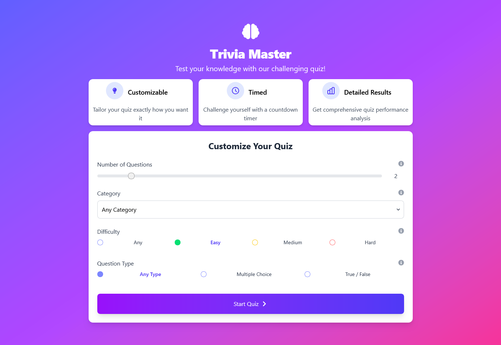
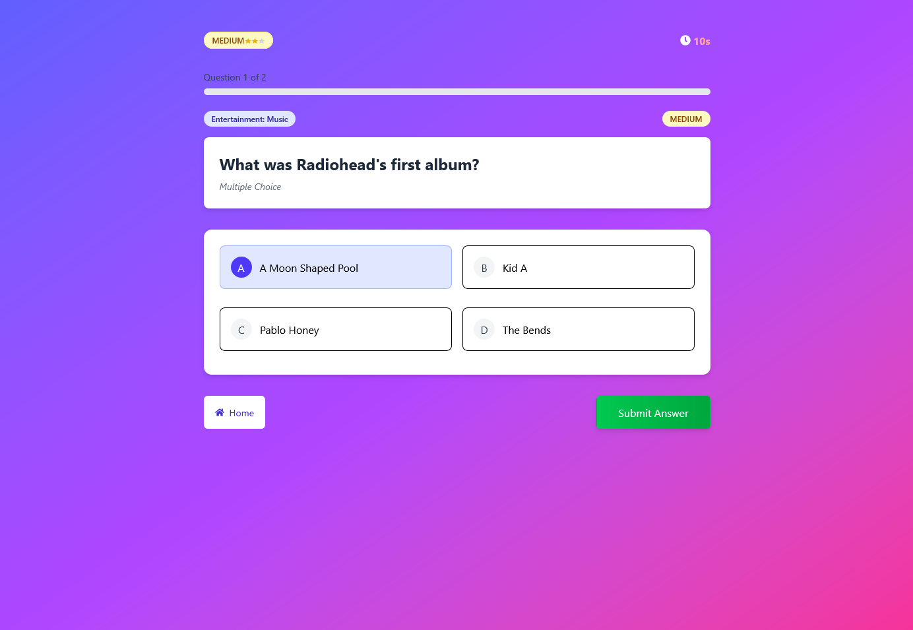
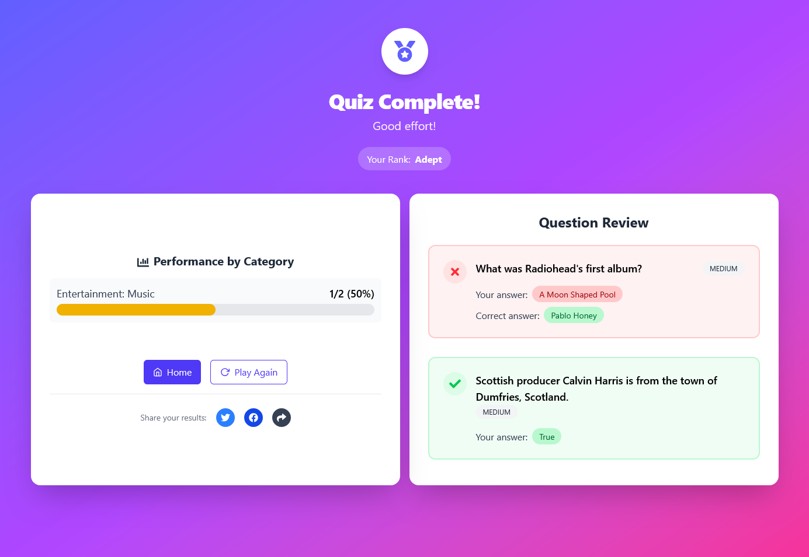

# Trivia Quiz Application

A modern, interactive trivia quiz application built with React, TypeScript, and Tailwind CSS. Challenge yourself with various quiz categories and difficulty levels!

## ✨ Features

- Choose from multiple quiz categories
- Select difficulty levels (Easy, Medium, Hard)
- Set the number of questions
- Timer for each question
- Score tracking
- Results summary with correct answers
- Responsive design for all devices

## 🚀 Technologies Used

- React 19
- TypeScript
- Tailwind CSS
- React Router for navigation
- Zustand for state management

## 📸 Screenshots

### Home Screen

_Description: The landing page where users can configure and start their quiz._

### Quiz Interface

_Description: The interactive quiz interface where users answer questions._

### Results Page

_Description: The final results screen showing the user's performance._
